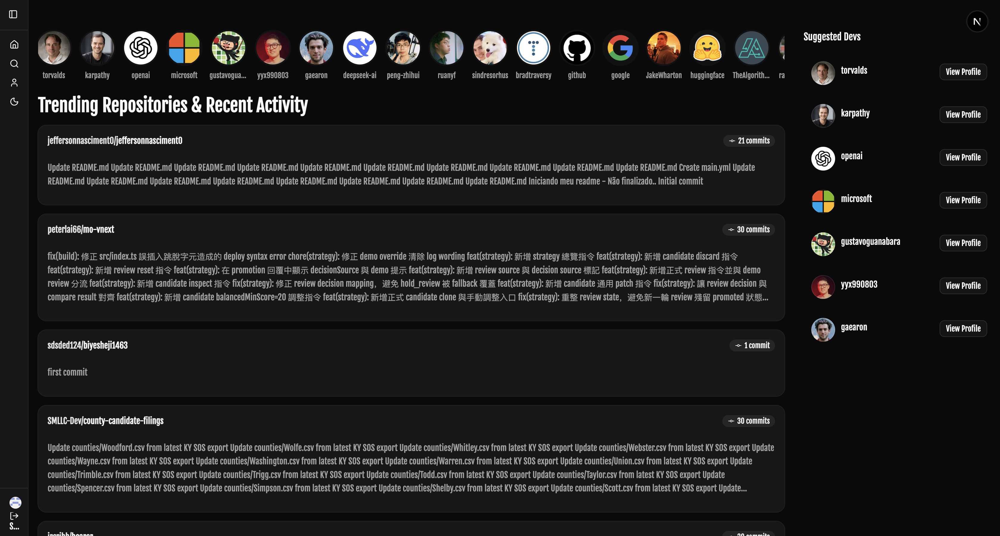
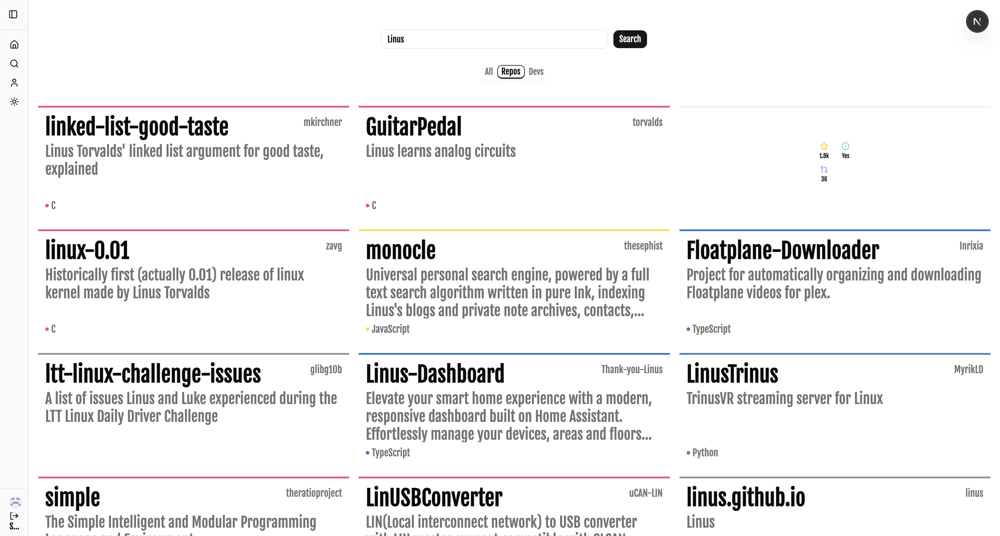
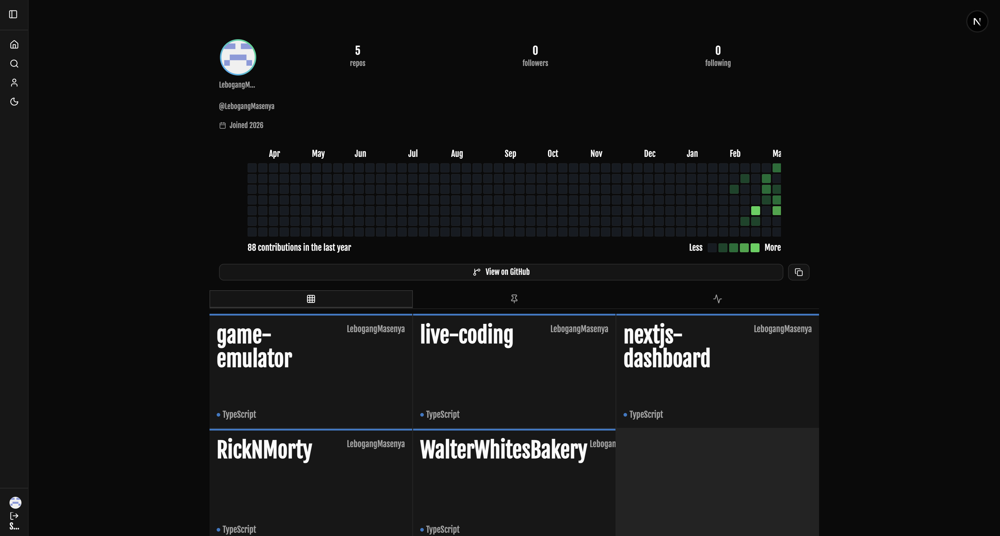
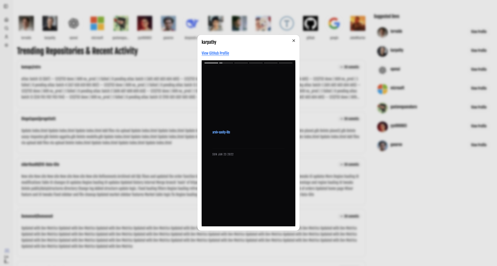
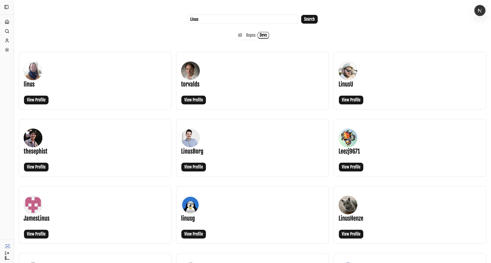
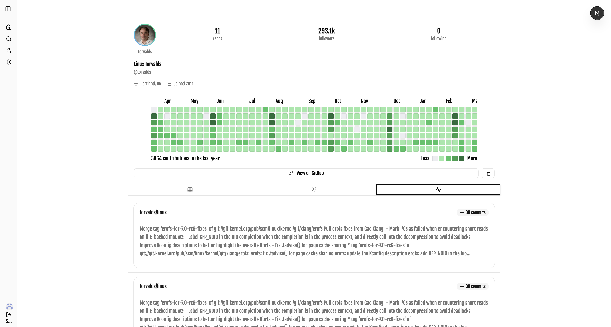
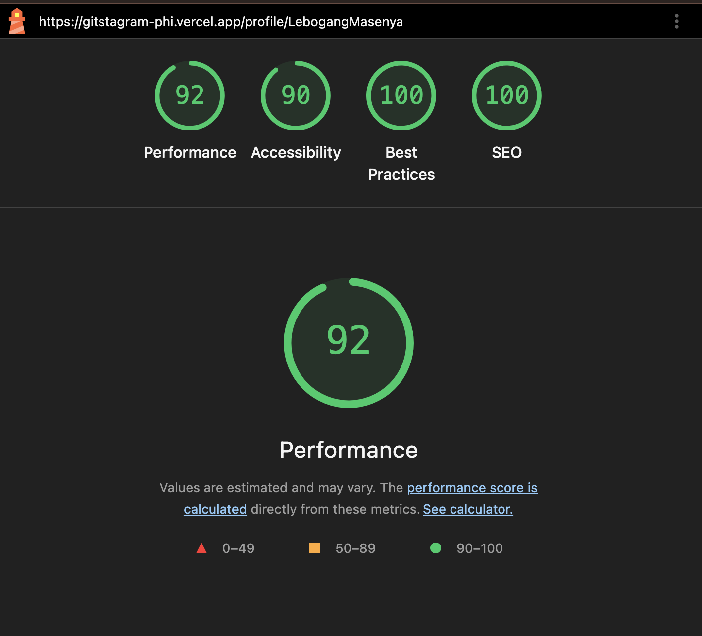

# Gitstagram
> **Instagram for Developers.** Turn your daily GitHub commits into interactive, engaging social media platform.

---

## Features

- **Commit Stories:** Transforms GitHub `PushEvents` into a familiar 9:16 vertical story format (experimental feature).
- **Dynamic Trending Feed:** Discover other developers and see their latest activity in a horizontal scroll.
- **GitHub OAuth:** Secure, one-click login using your GitHub profile.
- **Responsive UI:** Optimized for both mobile "tapping" and desktop "clicking" experiences.
- **Real-time API Integration:** Fetches fresh data directly from the GitHub REST API.

---

## Screenshots

| **Feed Overview** | **Explore PageView** | **User Profile** |
| :---: | :---: | :---: |
|  |  |  |
|  |  |  |

---

## Tech Stack

- **Core:** [Next.js 15 (App Router)](https://nextjs.org/)
- **Runtime:** [Bun](https://bun.sh/)
- **Auth:** [Auth.js (NextAuth v5)](https://authjs.dev/)
- **Fetching:** [TanStack Query v5](https://tanstack.com/query/latest)
- **Styling:** [Tailwind CSS](https://tailwindcss.com/)
- **Components:** [Shadcn/UI](https://ui.shadcn.com/) 
- **Animation:** [React Insta Stories](https://github.com/mohitadwani/react-insta-stories)
- **Icons:** [Lucide React](https://lucide.dev/)

---

## Documentation & References
### Architetcure
- **NextJS**: understanding project setup for a full stack application and the rules of the framework [docs](https://nextjs.org/docs)

### APIs & Auth
- **GitHub REST API:** Used for fetching User Events, Repositories, and Commits.
  - [Events API Reference](https://docs.github.com/en/rest)
- **Auth.js (NextAuth):** Handling the OAuth2 flow with GitHub.
  - [GitHub Provider Setup](https://authjs.dev/getting-started/providers/github)

### Performance & Optimization
- **Next.js Image:** Critical for optimizing remote GitHub avatars.
  - [Remote Patterns Config](https://nextjs.org/docs/pages/api-reference/components/image)
- **Lighthouse:** Guiding the SEO and Accessibility improvements.
  - [Web Vitals Guide](https://web.dev/vitals/)
- **Tanstack Query**: Used for `infinite query` and `use query` for effectively fetching data from the API.
    - [docs](https://tanstack.com/query/latest/docs/framework/react/overview)

### UI Components
- **React Insta Stories:** The engine driving the vertical story transitions.
  - [Package Documentation](https://www.npmjs.com/package/react-insta-stories)
  - [CodeSandbox](https://codesandbox.io/examples/package/react-insta-stories)
- **Tailwind CSS:** For the "Zinc/Dark" aesthetic inspired by GitHub's dark mode.
- **ShadCN**: For component property options.
- **Aceternity UI**: Used for 3D [Git Globe](https://ui.aceternity.com/components/github-globe)

---
## Lighthouse Metrics

